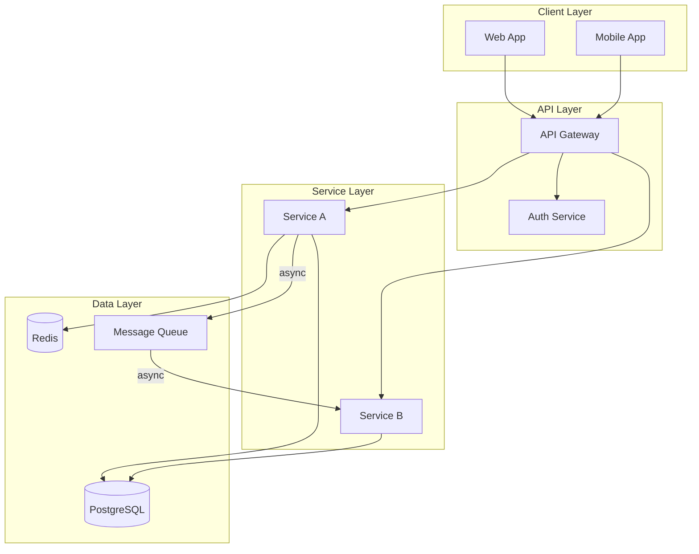
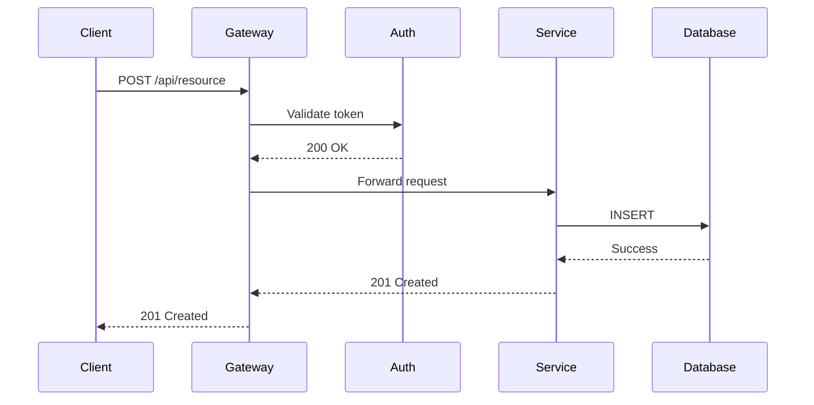
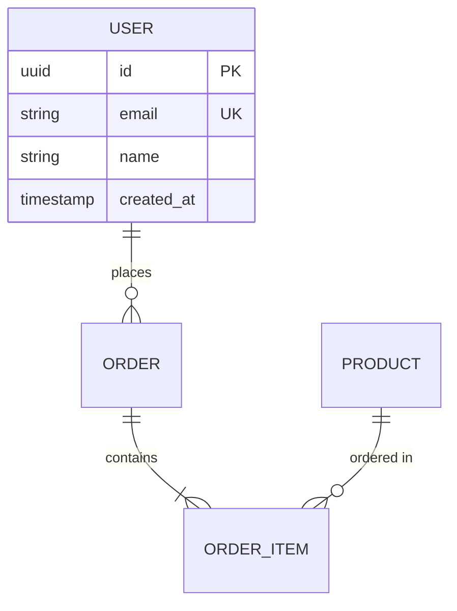

# Mermaid Diagram Guide

Reference for generating architecture diagrams using Mermaid syntax.

## Diagram Types for Architecture

| Diagram Type | Use For | Mermaid Keyword |
|-------------|---------|-----------------|
| System topology | Component relationships, data flow | `graph` or `flowchart` |
| Sequence | API call flows, auth handshakes | `sequenceDiagram` |
| Entity relationship | Database schema design | `erDiagram` |
| State machine | Workflow states, order lifecycle | `stateDiagram-v2` |
| Class diagram | Domain model, service interfaces | `classDiagram` |
| C4 Context | System context boundaries | `C4Context` |

## System Topology Template

## Sequence Diagram Template

## ER Diagram Template

## Style Conventions

| Element | Shape | Example |
|---------|-------|---------|
| Service/API | Rectangle | `[Service Name]` |
| Database | Cylinder | `[(Database)]` |
| Queue/Topic | Parallelogram | `[/Queue/]` |
| External system | Rounded rect | `(External API)` |
| User/Client | Stadium | `([User])` |

## Arrow Conventions

| Arrow | Meaning |
|-------|---------|
| `-->` | Synchronous call |
| `-- async -->` | Asynchronous message |
| `-.->` | Optional/conditional |
| `==>` | Data flow (heavy) |

## Subgraph Usage

Group components by:
- Deployment boundary (VPC, cluster, region)
- Domain boundary (user service, payment service)
- Layer (client, API, service, data)

## Checklist Before Delivery

| Check | Requirement |
|-------|-------------|
| All components from spec present | Yes |
| Data flow direction arrows correct | Yes |
| Async vs sync communication distinguished | Yes |
| External system boundaries marked | Yes |
| Database types indicated | Yes |
| Subgraphs match deployment topology | Yes |
